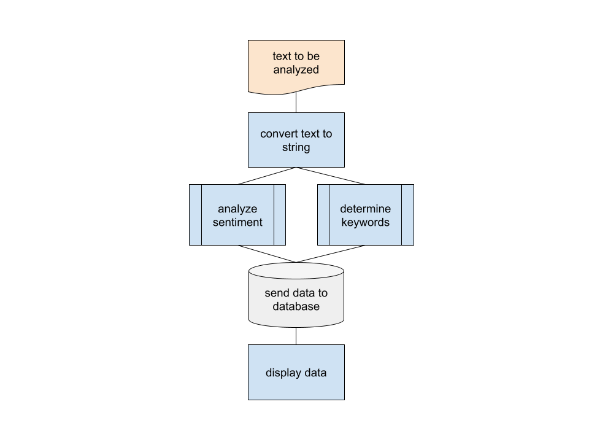

[](https://classroom.github.com/online_ide?assignment_repo_id=7556331&assignment_repo_type=AssignmentRepo)
# Privacy Tracker Data Dashboard

Rachael Harris

## Description of Prototype

This prototype is a type of data dashboard that would visualize text-based analyzation of current Privacy Legislation proposed within the United States. It could be expanded to include more types of analysis and more locations with similar legislation.

Currently, the tool will visualize:
- Legislation Sentiment Analysis by state
- Legislation Sentiment Analysis by year
- Keyword word cloud

In the future, my goal is to automate this to scrape congress.gov for upcoming legislation (to be categorized separately) to compare to already published policies.

## Design



The process for this tool is truly quite simple.

At the start, the data is either processed individually or together as a folder (see `src/sentiment_analysis.py` for more details). The text to be analyzed is then passed to the `convert_text_to_string()` function, which will convert the `.tex` or `.txt` file to a String so that it can later be cast to a `blob.`

After being cast to a `blob`, the `blob`'s sentiment is analyzed using `TextBlob`. At this point, the keywords are also determined.

The results of this analysis are stored in a database, which is used to create the data visualizations.

## Features

- *Sentiment Analysis*: Sentiment analysis (or opinion mining) is a natural language processing (NLP) technique used to determine whether data is positive, negative or neutral.
    - Our data is ranked on a scale of -1 to 1, with -1 being the most negative, 1 being the most positive, and 0 being completely neutral.
- *Keyword Analysis*: insight into how often certain words are used within a text


## Installation requirements

To install this project, clone the repository using SSH, HTTPS, or Git.


## How to run prototype

To run this project, run the following commands:

1. `cd src`
2. `python3 legislation_analysis.py`

Sample output:

```
data/California-CCPA.txt
0.025756542392605587
label: positive
```

## References

[Textblob Documentation](https://github.com/sloria/TextBlob)

[IAPP Privacy Legislation Data](https://iapp.org/media/pdf/resource_center/State_Comp_Privacy_Law_Chart.pdf)

[Federal Legislation Data](https://bipartisanpolicy.org/data-privacy-framework/)
